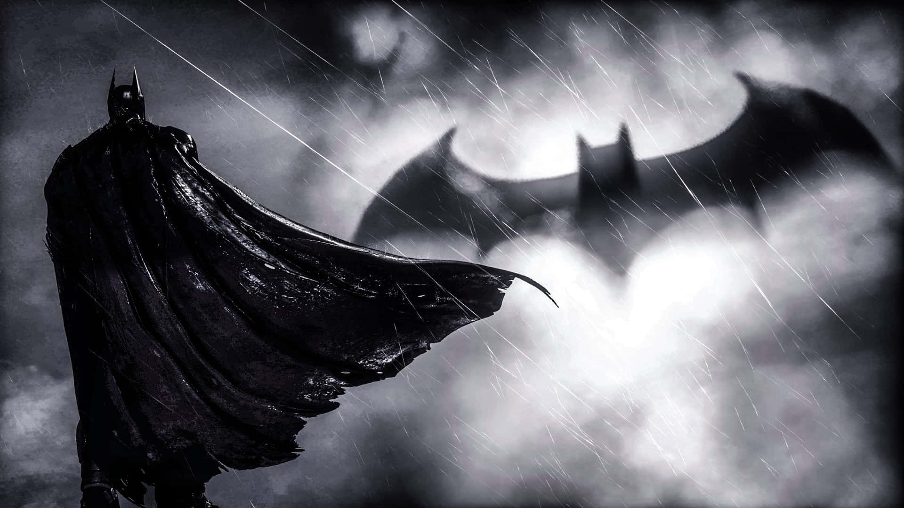

<div align="center">


<br/>

<div align="center">
  
</div>

[](https://git.io/typing-svg)

<br/>


[](https://github.com/ChandraPrakash-Bathula)
[](https://www.linkedin.com/in/chandra-prakash-bathula)

</div>

---

<div align="center">

*"It's not who I am underneath — but what I build that defines me."*

</div>

---

## `> IDENTITY`

```
┌─────────────────────────────────────────────────────────────┐
│  ALIAS      : Chandra Prakash Bathula                       │
│  BASE       : Saint Louis University — St. Louis, MO        │
│  CLEARANCE  : M.S. Information Systems  |  GPA: 3.93 / 4.0  │
│  ROLES      : Adjunct Faculty · AI/ML Engineer · Researcher │
│  ARSENAL    : React · PyTorch · AWS · Docker · HuggingFace  │
│  OPERATIVES : 300+ Students Mentored                        │
│  PROJECTS   : 40+ Full-Stack Apps Deployed                  │
│  MISSION    : Build AI-powered systems. Eliminate noise.    │
└─────────────────────────────────────────────────────────────┘
```

---

## `> SYSTEMS`

<table>
<tr>
<td width="50%" valign="top">

```
[ UTILITY BELT — Engineering ]
──────────────────────────────
▸ React / Vue / Next.js    DEPLOYED
▸ FastAPI · Node.js · PostgreSQL ONLINE
▸ AWS: S3 · EC2 · RDS · DynamoDB LIVE
▸ iPaaS Automation       40% CUT
▸ Analytics Dashboards  REAL-TIME
▸ SLU Web Systems       30% FASTER
```

</td>
<td width="50%" valign="top">

```
[ BATCOMPUTER — AI & Research ]
────────────────────────────────
▸ NLP: BERT · Word2Vec · TF-IDF  TRAINED
▸ Vision: CNN · ResNet50   92.59% ACC
▸ GenAI: RAG · Agentic RAG · LangChain
▸ PyTorch & TensorFlow    OPTIMIZED
▸ Research Paper (1st Author)  LIVE
▸ CCSC Conference Talk    DELIVERED
```

</td>
</tr>
</table>

---

## `> CASE FILES — FIELD MISSIONS` *(Experience)*

```
[ CASE 01 ] SAINT LOUIS UNIVERSITY — School for Professional Studies
            AI/ML Engineer & Researcher | Adjunct Faculty            Aug 2024 – Present
────────────────────────────────────────────────────────────────────────────
▸ Running covert ops on network anomaly detection — benchmarking 20+ ML
  models across 8+ cyberattack categories.
▸ Built & deployed RAG Pipeline Studio (FastAPI + React) — 4 chunking
  strategies, 5 embedding models, FAISS search, dual LLM providers
  (Ollama + Groq) — armed 300+ grad students with hands-on RAG intel.
▸ Led a 2-engineer strike team building a live workforce management
  platform on React/Tailwind + Node.js/AWS — now serving employment
  specialists and job seekers across Missouri.
▸ Designed the Applied Deep Learning curriculum for 300+ students —
  10+ live playgrounds, 20+ capstones mentored, 95%+ completion rate.

[ CASE 02 ] SAINT LOUIS UNIVERSITY — iPaaS & Internal Tools Team
            Software Engineer Intern, AI & Workflow Automation        Mar 2023 – Dec 2023
────────────────────────────────────────────────────────────────────────────
▸ Infiltrated a 5,000+ monthly-ticket IT triage bottleneck — designed a
  Python ML priority-routing system — projected 40% faster triage,
  30% better SLA compliance.
▸ Prototyped a CNN-based Lost & Found classifier — projected 35% less
  sorting time, 28% better item-matching across 10,000+ photos/month.

[ CASE 03 ] QENTELLI SOLUTIONS PVT LTD — Hyderabad, India
            Associate Software Engineer                               Mar 2021 – Jul 2022
────────────────────────────────────────────────────────────────────────────
▸ Built the Electron.js + Vue.js front end for TED — an AI-powered IT
  Ops dashboard integrating 150+ SDLC tools.
▸ Shipped MOBE, a multi-device mobile testing platform, to 5,000+ users
  across 3 enterprise apps.
▸ Pushed Jest coverage to 92% and Webpack 5 optimizations — 25% faster
  release cycles.
```

---

## `> MISSION LOGS` *(Projects)*

| `STS` | Mission | Stack | Intel |
|:-----:|:--------|:------|:------|
| `ACT` | **RAG Pipeline Studio** | FastAPI · React · FAISS · Ollama · Groq | Pedagogical RAG system, 300+ students, 5-step wizard |
| `ACT` | **CNNs vs. Vision Transformers** *(Research Study)* | PyTorch · TensorFlow · scikit-learn | 10 architectures, 9 datasets — from-scratch CNNs beat ViTs by 18.3 pts |
| `ACT` | **Agentic AI Benchmarking Framework** | OpenAI · Zapier · Prompt Engineering | 36 benchmark tasks across no-code/low-code/LLM agents |
| `ACT` | [**CIFAR-10 CNN**](https://huggingface.co/chandu1617/CIFAR10-CNN_Model) | PyTorch · CNN · HF | **92.59% acc** · 9 layers · [Demo ↗](https://huggingface.co/spaces/chandu1617/cifar10-cnn-demo) |
| `ACT` | [**Food-101 ResNet50**](https://huggingface.co/chandu1617/Food_101_Classification_ResNet50) | PyTorch · CV | 101-class image classifier |
| `ACT` | [**NYC Taxi Predictor**](https://huggingface.co/spaces/chandu1617/NYC_Taxi_Trip_Duration_Predictor) | ML · HF Spaces | Live trip duration prediction |
| `ACT` | [**MoodFlix / VizFlix**](https://viz-flix-gpt.vercel.app/) | React · Redux · OpenAI | GPT recs · **+30% engagement** |
| `ACT` | [**TubeFlix**](https://utubeflix-79845.web.app/) | React · Firebase | 1K+ videos · **30% faster loads** |
| `ACT` | [**EliteNotes**](https://elite-notes-poc.vercel.app/) | React · Firebase · NLP | 7 ML features: transcribe · tag · summarize |
| `ACT` | **3D PCA Visualizer** | Python · Plotly · Word2Vec | 10K embeddings · **85% complexity cut** |
| `ACT` | **Apparel Recommender** | TF-IDF · CNN · Word2Vec | **+20% rec accuracy** via text+image fusion |

---

## `> ARMORY`

<div align="center">


</div>

---

## `> BATCOMPUTER — LIVE STATS`

<div align="center">


</div>

---

## `> TROPHY VAULT`

<div align="center">
  
</div>

```
[✓] First Author — "Developing an Enterprise Application Tool to
    Discover Midwest Job Trends," Journal of Computing Sciences in
    Colleges, 40(6), pp. 75–89. doi:10.5555/3729857.3729866
[✓] Distinguished Graduate — M.S. in Information Systems, GPA 3.93/4.0
[✓] Speaker — CCSC Central Plains Conference @ Drake University
[✓] 40+ Full-Stack Production Projects Deployed
[✓] 20+ Capstone Projects Guided End-to-End
```

---

## `> BAT-SIGNAL — OPEN COMMS`

<div align="center">

[](https://portfolio-chandra-prakash-bathulas-projects.vercel.app)
[](https://www.linkedin.com/in/chandra-prakash-bathula)
[](https://medium.com/@ChandraPrakash-Bathula)
[](https://github.com/ChandraPrakash-Bathula)
[](mailto:chandu.bathula16@gmail.com)

</div>

---

<div align="center">


</div>
