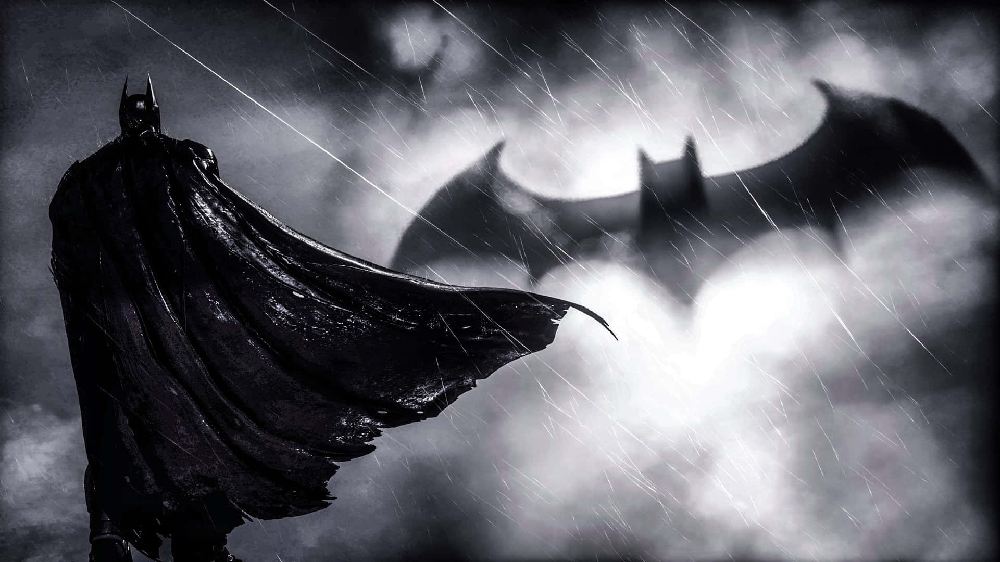
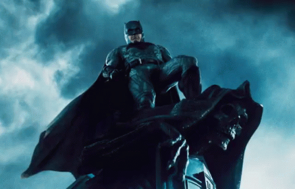

<div align="center">
  
  <br/>
  
  <!--  -->
  <br/>
  <br/>
  
  <br/>
  <br/>
  
  <a href="https://github.com/ChandraPrakash-Bathula">
    
  </a>
  <a href="https://www.linkedin.com/in/chandra-prakash-bathula">
    
  </a>
</div>

---

<div align="center">
  <em>"It's not who I am underneath — but what I build that defines me."</em>
</div>

---

## `> IDENTITY`

```text
┌─────────────────────────────────────────────────────────────┐
│  ALIAS      : Chandra Prakash Bathula                       │
│  BASE       : Saint Louis University — St. Louis, MO        │
│  CLEARANCE  : M.S. Information Systems  |  GPA: 3.93 / 4.0  │
│  ROLES      : Adjunct Faculty · AI/ML Engineer · Researcher │
│  ARSENAL    : PyTorch · HuggingFace · LangChain · AWS       │
│  FOCUS      : Computer Vision · NLP · Agentic AI            │
│  OPERATIVES : 300+ Students Mentored                        │
│  MISSION    : Build AI-powered systems. Eliminate noise.    │
└─────────────────────────────────────────────────────────────┘
```

---

## `> SYSTEMS`

<table>
<tr>
<td width="50%" valign="top">

```text
[ UTILITY BELT — ML Engineering ]
──────────────────────────────
▸ RAG Pipelines · FAISS      ACTIVE
▸ Agentic Workflows        DEPLOYED
▸ FastAPI · Docker           ONLINE
▸ AWS Lambda · S3 · EC2      ONLINE
▸ HuggingFace Spaces           LIVE
▸ iPaaS Automation          40% CUT
```

</td>
<td width="50%" valign="top">

```text
[ BATCOMPUTER — AI & Research ]
────────────────────────────────
▸ NLP: Word2Vec · TF-IDF   TRAINED
▸ Vision: CNN · ResNet50  92.59% ACC
▸ PyTorch & TensorFlow   OPTIMIZED
▸ Research Paper (1st Author) LIVE
▸ CCSC Conference Talk   DELIVERED
▸ 3D PCA — 10K Vectors  85% SIMPLER
```

</td>
</tr>
</table>

---

## `> MISSION LOGS`

| `STS` | Mission | Stack | Intel |
|:-----:|:--------|:------|:------|
| `ACT` | [**CIFAR-10 CNN**](https://huggingface.co/chandu1617/CIFAR10-CNN_Model) | PyTorch · CNN · HF | **92.59% acc** · 9 layers · [Demo ↗](https://huggingface.co/spaces/chandu1617/cifar10-cnn-app) |
| `ACT` | [**Food-101 ResNet50**](https://huggingface.co/chandu1617/Food_101_Classification_ResNet50) | PyTorch · CV | 101-class image classifier |
| `ACT` | [**NYC Taxi Predictor**](https://huggingface.co/spaces/chandu1617/NYC_Taxi_Trip_Duration_Predictor) | ML · HF Spaces | Live trip duration prediction |
| `ACT` | [**Show the Wire**](https://huggingface.co/spaces/ChandraPrakashBathula/show-the-wire) | LLM · Tool Calling · HF | Runtime tool discovery & calling |
| `ACT` | **3D PCA Visualizer** | Python · Plotly · Word2Vec | 10K embeddings · **85% complexity cut** |
| `ACT` | **Apparel Recommender** | TF-IDF · CNN · Word2Vec | **+20% rec accuracy** via text+image fusion |

---

## `> ARMORY`

<div align="center">
  
  
  
  
  
  
  
  
  
  
</div>

---

## `> BATCOMPUTER — LIVE STATS`

<div align="center">
  
</div>

---

## `> TROPHY VAULT`

<div align="center">
  
</div>

```text
[✓] First Author  — "Developing an Enterprise Application Tool to Discover Midwest Job Trends."
[✓] Distinction & Distinguished Graduate — Master's Research & Academic Excellence.
[✓] Paper Presentation & Poster Judge — CCSC Central Plains Conference @ Drake University - 2025.
[✓] 20+ Capstone Projects Guided End-to-End.
```

---

## `> BAT-SIGNAL — OPEN COMMS`

<div align="center">
  <a href="https://portfolio-chandra-prakash-bathulas-projects.vercel.app"></a>
  <a href="https://www.linkedin.com/in/chandra-prakash-bathula"></a>
  <a href="https://medium.com/@ChandraPrakash-Bathula"></a>
  <a href="https://github.com/ChandraPrakash-Bathula"></a>
  <a href="mailto:chandu.bathula16@gmail.com"></a>
</div>

---

<div align="center">
  
</div>

---

## `> BATCAVE — LIVE 3D SCENE`

> 🦇 **[Launch Interactive Batcave](https://chandraprakash-bathula.github.io/batman/)** — Bat Signal · Batmobile · 3D Logo
